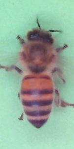
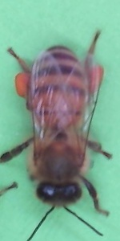
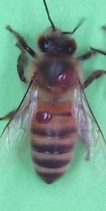
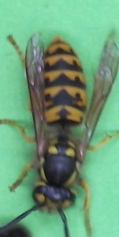

# Sugar-Free Honey

In your capacity as a Data Scientist in the AI & Analytics CoE you are contacted by a fellow data scientist from the Line of Business (LoB) in NN. His department focuses on developing innovative consumer products for people with diabetes. He is currently involved in a project where they have genetically engineered bees to produce delicious sugar-free honey, and for the last half year he has been developing an automated image-based solution to monitor the productivity and well-being of the bees.

They have successfully developed an IoT platform for acquiring and streaming images of bees to the cloud where they can be utilized to evaluate the performance and health of the hives. 

The dataset they have produced contain images of bees (and wasps) and is already labelled. Some examples of the images are:

| cooling | pollen | varroa| wasp|
|----|----|----|----|
| ||||

They have asked for your help validating, and serving the ML model in a REST-API, and would also like some suggestions of how to improve the model. 

After an initial meeting, you agree that you should help him with 

1. **Design an approach for validating the ML model and/or implement the validation in the code** 
 The data scientist is really unsure how to validate that the model performs at the expectation level of the business. He is hoping that you can propose metrics for the model validation, and help him to design model acceptance criteria. He has learned that the business expects at least an accuracy of 98% on the wasp detection! 
 2. **Feedback on approach and improving the classification result** 
 The data scientist is uncertain whether the choices     of network and loss function are optimal for the problem, and he is therefore keen to get your feedback and welcomes you to rewrite the code.
 3. **Serving the model in a REST-API** 
The data scientist has tried to serve the model using FastAPI but has not been able to complete the serving solution. You can finish the FastAPI solution or build your own proposal.
 4. **Suggest a solution to productizing the ML application (cloud)** 
 It is a solution requirement that the model training and deployment is automated and can be scheduled in regular intervals. It is up to you to design the automation solution.

You only have three hours to work on this as you are preparing for finalizing a big feauture in our MLOps platform. Naturally you might not be able to work on all the above in that period of time but try to focus on what interests you or where you feel you can bring more value.

When you meet the team you can then discuss your approach on what have you done and how you would have solved and approached any remaining issues.  
